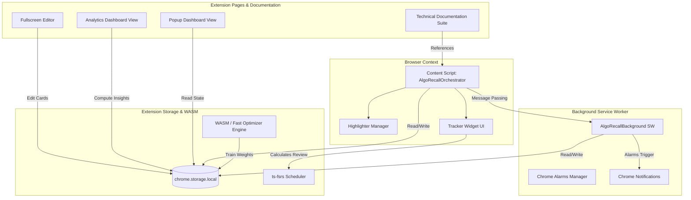

# AlgoRecall: Coding Interview Spaced Repetition Extension

> **AlgoRecall** is a free, 100% local-first Chrome Extension (Manifest V3) designed for coding interview spaced repetition and text highlighting. Powered by the **Free Spaced Repetition Scheduler (FSRS-4.5)** algorithm and WebAssembly (WASM) parameter optimization, it seamlessly tracks problem reviews on LeetCode, AlgoMonster, Codeforces, and other major platforms without signups or remote tracking.

---

## 📖 Technical & Architectural Documentation Index

> 🔗 **Main Documentation Index**: [docs/index.md](file:///Users/anmolrastogi/Documents/GitHub/algomonster-fsrs-extension/docs/index.md)

Below is the complete architectural layout and table of contents for the codebase documentation suite located in the [docs/](file:///Users/anmolrastogi/Documents/GitHub/algomonster-fsrs-extension/docs) directory:

```text
docs/
├── architecture/          # High-level MV3 system design, data pipelines, & state distribution
├── features/              # UI feature modules (Tracker, Dashboard, Analytics, Highlighter, Common, Customization, Requirements)
├── scheduler-wasm/        # FSRS algorithm theory, Rating selection guide, WASM optimizer, and performance benchmarks
├── runtime-core/          # Content script orchestrator, background service worker, & types
├── testing/               # Jest, Playwright E2E, and mock test infrastructure
└── index.md               # Main Documentation Table of Contents
```

---

## 📑 Detailed Documentation Navigation

### 1. Architecture & System Design
* 📘 [Architecture Overview](file:///Users/anmolrastogi/Documents/GitHub/algomonster-fsrs-extension/docs/architecture/overview.md) — High-level MV3 Chrome Extension architecture, background service worker lifecycle, and runtime message routing.
* 🔄 [End-to-End Data Flow](file:///Users/anmolrastogi/Documents/GitHub/algomonster-fsrs-extension/docs/architecture/data-flow.md) — Data pipelines connecting Chrome Storage, Background Service Worker, Content Scripts, and WASM runtime.
* 📦 [State Management](file:///Users/anmolrastogi/Documents/GitHub/algomonster-fsrs-extension/docs/architecture/state-management.md) — Distributed state architecture, `StorageData` schema, and reactive `chrome.storage.onChanged` synchronization.

### 2. Feature Modules & Developer Guides
* 🎯 [Tracker & Editor](file:///Users/anmolrastogi/Documents/GitHub/algomonster-fsrs-extension/docs/features/tracker.md) — In-page overlay widget, full-screen card editor, rating controls, rapid re-review debouncing, and preState snapshots.
* 📊 [Dashboard & Views](file:///Users/anmolrastogi/Documents/GitHub/algomonster-fsrs-extension/docs/features/dashboard.md) — Dashboard views: Popup, Heatmap, Forecast, Pomodoro timer, Study Plan, Summary generator, and History.
* 📈 [Analytics Engine](file:///Users/anmolrastogi/Documents/GitHub/algomonster-fsrs-extension/docs/features/analytics.md) — Algorithmic memory health, retention curves, exam readiness, review velocity, confidence bands, and future memory simulation.
* 🖍️ [Highlighter & Options](file:///Users/anmolrastogi/Documents/GitHub/algomonster-fsrs-extension/docs/features/highlighter.md) — In-page text selection highlighter, CSS Custom Highlights API integration, DOM metadata range recovery, and card linking.
* 🛠️ [Common Utilities & Data](file:///Users/anmolrastogi/Documents/GitHub/algomonster-fsrs-extension/docs/features/common.md) — Gzip JSONL streaming `BackupManager`, FNV-1a checksum validation, domain whitelisting, Firebase integration, logger, and theme sync.
* ⚙️ [Developer & Customization Guide](file:///Users/anmolrastogi/Documents/GitHub/algomonster-fsrs-extension/docs/features/customization.md) — Step-by-step recipes for registering new coding platforms, modifying highlighter palettes, adjusting FSRS parameters, and editing CSS variables.
* 📋 [Feature Enhancements Requirements](file:///Users/anmolrastogi/Documents/GitHub/algomonster-fsrs-extension/docs/features/requirements.md) — Comprehensive feature backlog, requirements matrix (P0–P3), and open design questions.

### 3. FSRS Scheduler & WASM Engine
* 🧮 [FSRS Algorithm & Math](file:///Users/anmolrastogi/Documents/GitHub/algomonster-fsrs-extension/docs/scheduler-wasm/fsrs-algorithm.md) — Mathematical foundations of FSRS-4.5, initial stability/difficulty formulas, retrievability decay, and state transitions.
* 📖 [FSRS Rating & State Transition Guide](file:///Users/anmolrastogi/Documents/GitHub/algomonster-fsrs-extension/docs/scheduler-wasm/rating-guide.md) — User and algorithmic guide for rating selection (`Again`, `Hard`, `Good`, `Easy`), state transition matrix, and partial recall strategies.
* ⚡ [WASM & Fast Optimizer](file:///Users/anmolrastogi/Documents/GitHub/algomonster-fsrs-extension/docs/scheduler-wasm/optimizer-wasm.md) — `@open-spaced-repetition/binding` WASM binding, WASI worker execution, parameter training, and `FsrsOptimizerFast` SGD fallback.
* 🚀 [Performance & Memory](file:///Users/anmolrastogi/Documents/GitHub/algomonster-fsrs-extension/docs/scheduler-wasm/performance.md) — WASM memory safety bounds, main-thread yielding heuristics, debouncing performance, and benchmark comparisons.

### 4. Runtime Core
* 🖥️ [Content Scripts](file:///Users/anmolrastogi/Documents/GitHub/algomonster-fsrs-extension/docs/runtime-core/content-scripts.md) — `AlgoRecallOrchestrator`, DOM MutationObserver, SPA client-side history navigation, and `Notifier` alerts.
* ⚙️ [Background Service Worker](file:///Users/anmolrastogi/Documents/GitHub/algomonster-fsrs-extension/docs/runtime-core/background-service.md) — `AlgoRecallBackground` service worker, `chrome.alarms` setup, quiet hours, push notifications, and background Pomodoro ticker.
* 📐 [Global Types & Utilities](file:///Users/anmolrastogi/Documents/GitHub/algomonster-fsrs-extension/docs/runtime-core/utils-and-types.md) — Core domain types (`domain.ts`), backup types (`backup.ts`), WASM declarations (`wasm-runtime.d.ts`), and Chrome extension types.

### 5. Testing & Verification
* 🧪 [Test Suite Overview](file:///Users/anmolrastogi/Documents/GitHub/algomonster-fsrs-extension/docs/testing/test-suite-overview.md) — Jest configuration, Playwright setup, `chromeMock.js` mock environment, and coverage reporters.
* 🔬 [Unit Test Suite](file:///Users/anmolrastogi/Documents/GitHub/algomonster-fsrs-extension/docs/testing/unit-tests.md) — Comprehensive breakdown of unit test modules covering FSRS, `dataUtils`, analytics, optimizer, and `backupManager`.
* 🎭 [E2E & Integration Tests](file:///Users/anmolrastogi/Documents/GitHub/algomonster-fsrs-extension/docs/testing/e2e-integration.md) — Integration test scenarios (`tracker.test.js`, `multiCard.test.js`) and Playwright end-to-end browser extension loading specs.

---

## 🧩 High-Level System Architecture Diagram



---

## 🚀 Quick Start & Development Commands

### Prerequisites
* **Node.js**: v18.0.0 or higher
* **npm**: v9.0.0 or higher

### Installation & Build
```bash
# Clone the repository
git clone https://github.com/sdeanmol/algomonster-fsrs-extension.git
cd algomonster-fsrs-extension

# Install dependencies
npm install

# Build production bundle for Chrome Extension
npm run build
```

### Running Test Suites
```bash
# Execute Jest unit & integration test suites
npm test

# Execute Playwright E2E browser tests
npx playwright test
```

### Loading Extension in Chrome
1. Open Google Chrome and navigate to `chrome://extensions`.
2. Enable **Developer mode** (toggle in upper right corner).
3. Click **Load unpacked** and select the `./build` folder generated by `npm run build`.

---

## 📄 License & Meta Information

* 🏪 [Chrome Web Store Guide](file:///Users/anmolrastogi/Documents/GitHub/algomonster-fsrs-extension/CHROMEWEBSTORE.md) — Store listing details, permission justifications, and privacy model.
* 🤖 [Migration Guidelines (`AGENTS.md`)](file:///Users/anmolrastogi/Documents/GitHub/algomonster-fsrs-extension/Agents.md) — Rules for TypeScript compilation, Webpack `CopyPlugin` safety, and build gates.
* 📜 [Third Party Licenses](file:///Users/anmolrastogi/Documents/GitHub/algomonster-fsrs-extension/THIRD_PARTY_LICENSES.md) — Declarations for third-party open source packages (`ts-fsrs`, `marked`).
