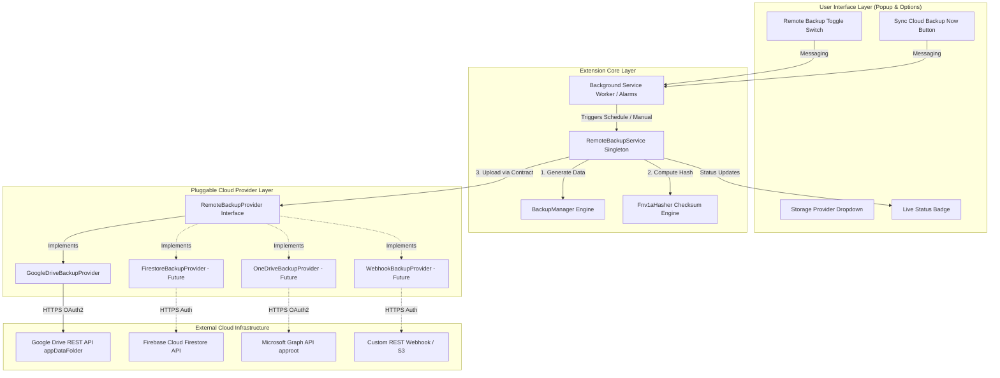
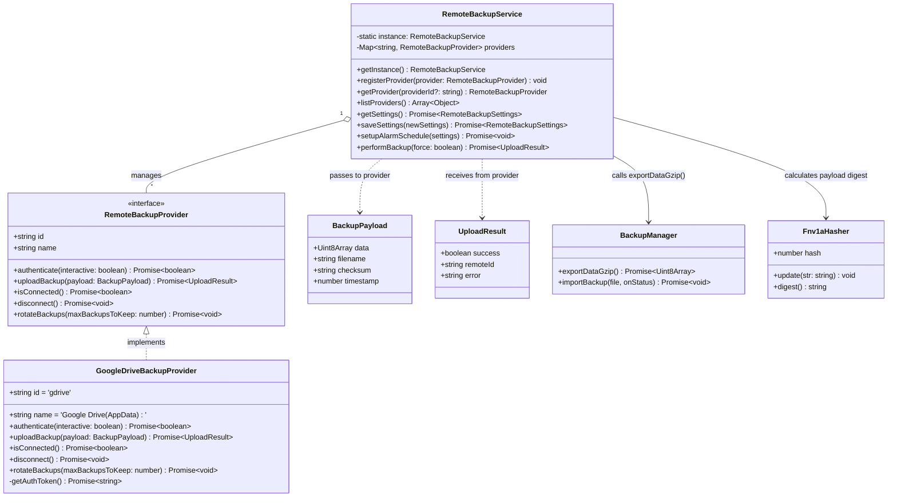
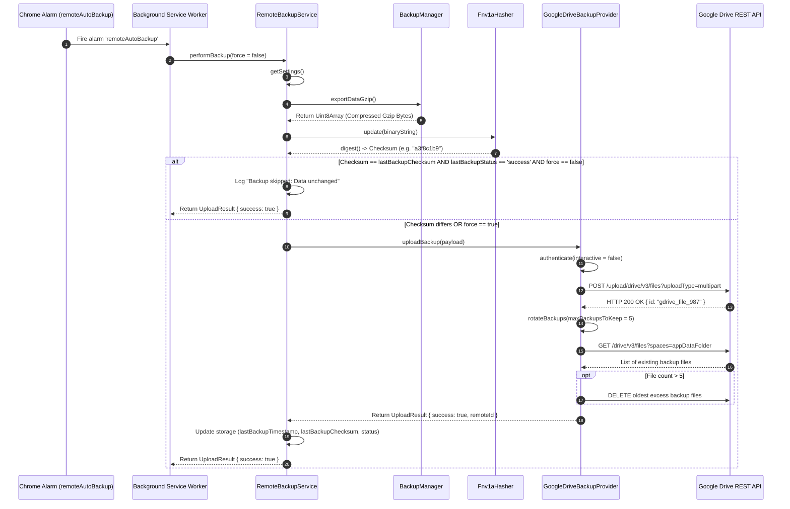
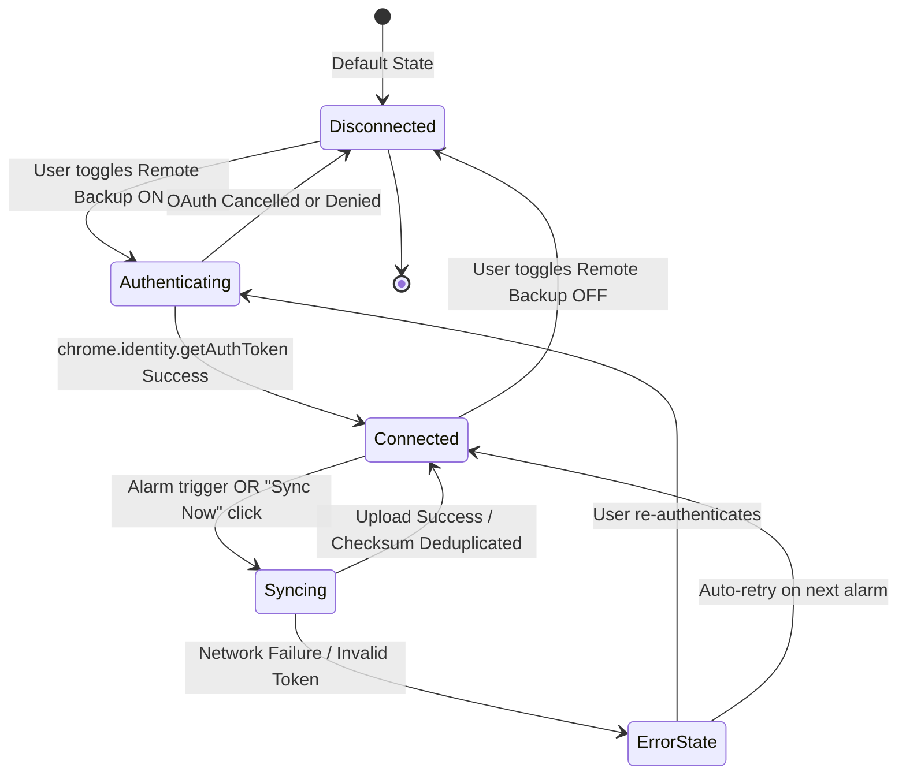
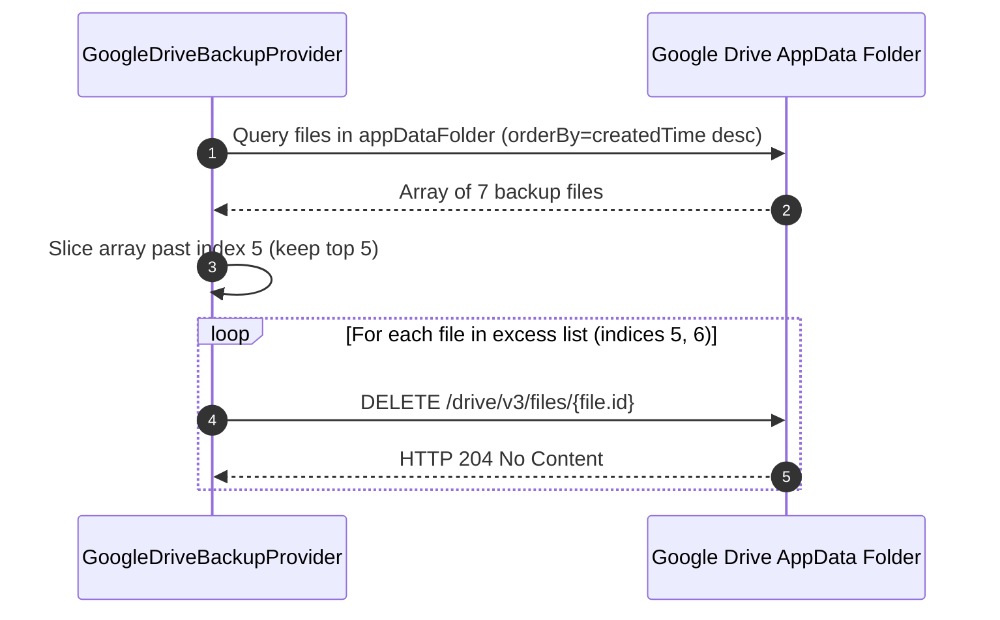

# Remote Cloud Auto-Backup Architecture & Developer Guide

## Table of Contents
1. [Overview & Design Philosophy](#overview--design-philosophy)
2. [High-Level Component Topology](#high-level-component-topology)
3. [Core Class & Interface Architecture](#core-class--interface-architecture)
4. [Detailed Sequence & State Diagrams](#detailed-sequence--state-diagrams)
   - [Automated Background Sync & Deduplication Pipeline](#1-automated-background-sync--deduplication-pipeline)
   - [User Authentication & Connection Lifecycle](#2-user-authentication--connection-lifecycle)
   - [Backup Rotation & Retention Lifecycle](#3-backup-rotation--retention-lifecycle)
5. [Data Flow & Checksum Deduplication Engine](#data-flow--checksum-deduplication-engine)
6. [Current Implementation: Google Drive AppData Provider](#current-implementation-google-drive-appdata-provider)
7. [Step-by-Step Guide: Adding Future Backup Providers](#step-by-step-guide-adding-future-backup-providers)
   - [Option 1: Firebase Cloud Firestore Provider (`FirestoreBackupProvider`)](#option-1-firebase-cloud-firestore-provider-firestorebackupprovider)
   - [Option 3: Microsoft OneDrive / Graph API Provider (`OneDriveBackupProvider`)](#option-3-microsoft-onedrive--graph-api-provider-onedrivebackupprovider)
   - [Option 4: Custom Webhook / S3 Pre-Signed Endpoint Provider (`WebhookBackupProvider`)](#option-4-custom-webhook--s3-pre-signed-endpoint-provider-webhookbackupprovider)
   - [Option 5: Apple iCloud Drive / WebDAV Provider (`WebDavBackupProvider`)](#option-5-apple-icloud-drive--webdav-provider-webdavbackupprovider)
8. [Error Handling, Failure Recovery & Edge Cases](#error-handling-failure-recovery--edge-cases)
9. [Testing & Verification Suite](#testing--verification-suite)

---

## Overview & Design Philosophy

The **Remote Cloud Auto-Backup System** in AlgoRecall provides automatic background synchronization of flashcards, FSRS stability metrics, highlight notes, bookmarks, and user configurations to cloud storage providers.

### Key Design Principles

1. **Pluggable Architecture (Open-Closed Principle)**:
   The core service (`RemoteBackupService`) is open for extension via provider plugins but closed for modification. Adding a new cloud provider requires **zero changes** to existing background worker loops, alarms, or UI event listeners.
2. **Zero Overhead Checksum Deduplication**:
   Before initiating network calls, the system computes a 32-bit FNV-1a checksum hash over the compressed Gzip payload. If the local checksum matches the previous successful backup checksum, the network request is bypassed.
3. **Local-First & Data Isolation**:
   Backups are stored inside hidden, application-specific data folders (e.g. Google Drive `appDataFolder`) isolated from user personal files.
4. **Automated Retention Management**:
   Cloud providers automatically enforce rolling retention policies (e.g. retaining the 5 most recent snapshots and deleting expired ones).

---

## High-Level Component Topology

The diagram below maps the interaction between UI controls, background processes, serialization utilities, provider modules, and external cloud services:



---

## Core Class & Interface Architecture



---

## Detailed Sequence & State Diagrams

### 1. Automated Background Sync & Deduplication Pipeline

This sequence details how background auto-backups determine whether an upload is necessary:



---

### 2. User Authentication & Connection Lifecycle



---

### 3. Backup Rotation & Retention Lifecycle



---

## Data Flow & Checksum Deduplication Engine

To save battery, CPU, network bandwidth, and cloud storage quotas, AlgoRecall uses an incremental **FNV-1a 32-bit checksum pipeline**:

```
+--------------------------+
|  chrome.storage.local    |
| (cards, marks, settings) |
+------------+-------------+
             |
             v
+--------------------------+
|  BackupManager           |
|  .exportDataGzip()       |
+------------+-------------+
             | Output: Gzip Uint8Array
             v
+--------------------------+
|  Fnv1aHasher             |
|  .update() & digest()    |
+------------+-------------+
             | Output: 8-char Hex Checksum (e.g., "7f8b91a2")
             v
     [ Checksum Match? ]
      /               \
   (YES)             (NO)
    /                   \
Skip Network        Upload to Cloud &
Upload              Save New Checksum
```

---

## Current Implementation: Google Drive AppData Provider

The default provider is implemented in `features/common/data/remote/providers/googleDriveProvider.ts`:

- **Scope**: `https://www.googleapis.com/auth/drive.appdata`
- **Isolation**: Files are stored exclusively in Google Drive's hidden `appDataFolder`. The user's normal Google Drive document list remains untouched.
- **Upload Format**: Multipart HTTP POST request formatted with boundary delimiter:
  - **Part 1 (`application/json`)**: Metadata JSON (`name`, `parents: ['appDataFolder']`, `description`).
  - **Part 2 (`application/gzip`)**: Base64-encoded Gzip backup byte data.
- **Token Cleanup**: When disconnected, `chrome.identity.removeCachedAuthToken` invalidates the cached token in Chrome.

---

## Step-by-Step Guide: Adding Future Backup Providers

Adding new storage backends (Firestore, OneDrive, Webhooks/S3, iCloud) requires zero modifications to core extension code. Simply implement the `RemoteBackupProvider` interface and register your new provider.

---

### Option 1: Firebase Cloud Firestore Provider (`FirestoreBackupProvider`)

This provider uses Cloud Firestore to store backup documents under `users/{userId}/backups/{backupId}`.

```typescript
/**
 * @file features/common/data/remote/providers/firestoreProvider.ts
 * @description Cloud Firestore provider implementing RemoteBackupProvider.
 */
import { RemoteBackupProvider, BackupPayload, UploadResult } from '../remoteBackupProvider';
import { Logger } from '@common/logger';

export class FirestoreBackupProvider implements RemoteBackupProvider {
    readonly id = 'firestore';
    readonly name = 'Firebase Cloud Firestore';

    private userId: string | null = null;

    async authenticate(interactive: boolean = false): Promise<boolean> {
        try {
            // Retrieve Firebase Auth token or chrome.identity Google Auth
            return new Promise<boolean>((resolve) => {
                if (typeof chrome === 'undefined' || !chrome.identity) {
                    resolve(false);
                    return;
                }
                chrome.identity.getAuthToken({ interactive }, (token) => {
                    if (chrome.runtime?.lastError || !token) {
                        resolve(false);
                    } else {
                        // Decode token or authenticate with Firebase Auth SDK
                        this.userId = 'user_google_authenticated';
                        resolve(true);
                    }
                });
            });
        } catch (err) {
            return false;
        }
    }

    async uploadBackup(payload: BackupPayload): Promise<UploadResult> {
        try {
            const auth = await this.authenticate(false);
            if (!auth || !this.userId) {
                return { success: false, error: 'User unauthenticated in Firestore.' };
            }

            // Convert Uint8Array payload data to Base64
            let binary = '';
            const bytes = payload.data;
            for (let i = 0; i < bytes.byteLength; i++) {
                binary += String.fromCharCode(bytes[i]);
            }
            const base64Content = btoa(binary);

            // Post document to Firestore REST API: users/{userId}/fsrsData
            const firestoreUrl = `https://firestore.googleapis.com/v1/projects/algomonster-fsrs/databases/(default)/documents/users/${this.userId}/backups`;
            
            const response = await fetch(firestoreUrl, {
                method: 'POST',
                headers: { 'Content-Type': 'application/json' },
                body: JSON.stringify({
                    fields: {
                        filename: { stringValue: payload.filename },
                        checksum: { stringValue: payload.checksum },
                        timestamp: { integerValue: payload.timestamp },
                        data: { stringValue: base64Content }
                    }
                })
            });

            if (!response.ok) {
                return { success: false, error: `Firestore HTTP ${response.status}` };
            }

            const data = await response.json();
            return { success: true, remoteId: data.name };
        } catch (err) {
            const errorMessage = err instanceof Error ? err.message : String(err);
            return { success: false, error: errorMessage };
        }
    }

    async isConnected(): Promise<boolean> {
        return this.authenticate(false);
    }

    async disconnect(): Promise<void> {
        this.userId = null;
    }

    async rotateBackups(maxBackupsToKeep: number = 5): Promise<void> {
        // Query Firestore backup collection and delete documents older than maxBackupsToKeep
    }
}
```

---

### Option 3: Microsoft OneDrive / Graph API Provider (`OneDriveBackupProvider`)

This provider uses Microsoft Graph API (`https://graph.microsoft.com/v1.0/me/drive/special/approot`) to save backups inside OneDrive's dedicated app folder.

```typescript
/**
 * @file features/common/data/remote/providers/oneDriveProvider.ts
 * @description Microsoft OneDrive provider implementing RemoteBackupProvider.
 */
import { RemoteBackupProvider, BackupPayload, UploadResult } from '../remoteBackupProvider';

export class OneDriveBackupProvider implements RemoteBackupProvider {
    readonly id = 'onedrive';
    readonly name = 'Microsoft OneDrive';

    private accessToken: string | null = null;

    async authenticate(interactive: boolean = false): Promise<boolean> {
        // Use OAuth2 flow for Microsoft Graph API
        return this.accessToken !== null;
    }

    async uploadBackup(payload: BackupPayload): Promise<UploadResult> {
        try {
            if (!this.accessToken) return { success: false, error: 'Not authenticated with OneDrive' };

            // Upload directly to special/approot folder in OneDrive
            const uploadUrl = `https://graph.microsoft.com/v1.0/me/drive/special/approot:/${payload.filename}:/content`;
            
            const response = await fetch(uploadUrl, {
                method: 'PUT',
                headers: {
                    'Authorization': `Bearer ${this.accessToken}`,
                    'Content-Type': 'application/gzip'
                },
                body: payload.data
            });

            if (!response.ok) {
                return { success: false, error: `OneDrive HTTP ${response.status}` };
            }

            const resData = await response.json();
            return { success: true, remoteId: resData.id };
        } catch (err) {
            const errorMessage = err instanceof Error ? err.message : String(err);
            return { success: false, error: errorMessage };
        }
    }

    async isConnected(): Promise<boolean> {
        return this.accessToken !== null;
    }

    async disconnect(): Promise<void> {
        this.accessToken = null;
    }
}
```

---

### Option 4: Custom Webhook / S3 Pre-Signed Endpoint Provider (`WebhookBackupProvider`)

For users who want to host their own backup server or push to AWS S3 / Cloudflare R2:

```typescript
/**
 * @file features/common/data/remote/providers/webhookProvider.ts
 * @description Custom REST Endpoint / Webhook provider implementing RemoteBackupProvider.
 */
import { RemoteBackupProvider, BackupPayload, UploadResult } from '../remoteBackupProvider';

export class WebhookBackupProvider implements RemoteBackupProvider {
    readonly id = 'webhook';
    readonly name = 'Custom REST Webhook / S3';

    private endpointUrl: string = '';
    private apiKey: string = '';

    constructor(endpointUrl: string = '', apiKey: string = '') {
        this.endpointUrl = endpointUrl;
        this.apiKey = apiKey;
    }

    async authenticate(interactive: boolean = false): Promise<boolean> {
        return this.endpointUrl.length > 0;
    }

    async uploadBackup(payload: BackupPayload): Promise<UploadResult> {
        try {
            if (!this.endpointUrl) {
                return { success: false, error: 'Custom Webhook URL is missing.' };
            }

            const response = await fetch(this.endpointUrl, {
                method: 'POST',
                headers: {
                    'Authorization': `Bearer ${this.apiKey}`,
                    'Content-Type': 'application/gzip',
                    'X-AlgoRecall-Checksum': payload.checksum,
                    'X-AlgoRecall-Filename': payload.filename
                },
                body: payload.data
            });

            if (!response.ok) {
                return { success: false, error: `Webhook Server HTTP ${response.status}` };
            }

            return { success: true };
        } catch (err) {
            const errorMessage = err instanceof Error ? err.message : String(err);
            return { success: false, error: errorMessage };
        }
    }

    async isConnected(): Promise<boolean> {
        return this.endpointUrl.length > 0;
    }

    async disconnect(): Promise<void> {
        this.endpointUrl = '';
        this.apiKey = '';
    }
}
```

---

### Option 5: Apple iCloud Drive / WebDAV Provider (`WebDavBackupProvider`)

For WebDAV-compliant cloud storage (e.g., Nextcloud, Owncloud, Apple WebDAV server):

```typescript
/**
 * @file features/common/data/remote/providers/webDavProvider.ts
 * @description WebDAV provider implementing RemoteBackupProvider.
 */
import { RemoteBackupProvider, BackupPayload, UploadResult } from '../remoteBackupProvider';

export class WebDavBackupProvider implements RemoteBackupProvider {
    readonly id = 'webdav';
    readonly name = 'Nextcloud / WebDAV';

    private serverUrl: string = '';

    async authenticate(interactive: boolean = false): Promise<boolean> {
        return this.serverUrl.length > 0;
    }

    async uploadBackup(payload: BackupPayload): Promise<UploadResult> {
        try {
            const targetUrl = `${this.serverUrl}/${payload.filename}`;
            const response = await fetch(targetUrl, {
                method: 'PUT',
                headers: { 'Content-Type': 'application/gzip' },
                body: payload.data
            });

            if (!response.ok) return { success: false, error: `WebDAV HTTP ${response.status}` };
            return { success: true };
        } catch (err) {
            const errorMessage = err instanceof Error ? err.message : String(err);
            return { success: false, error: errorMessage };
        }
    }

    async isConnected(): Promise<boolean> {
        return this.serverUrl.length > 0;
    }

    async disconnect(): Promise<void> {
        this.serverUrl = '';
    }
}
```

---

## How to Register & Activate a Provider

To register any new provider, add a single call inside `RemoteBackupService` (`features/common/data/remote/remoteBackupService.ts`):

```typescript
import { FirestoreBackupProvider } from './providers/firestoreProvider';
import { OneDriveBackupProvider } from './providers/oneDriveProvider';

private constructor() {
    this.registerProvider(new GoogleDriveBackupProvider());
    this.registerProvider(new FirestoreBackupProvider());
    this.registerProvider(new OneDriveBackupProvider());
}
```

Then update the options dropdown in `features/dashboard/popup/popup.html`:

```html
<select id="remote-provider-select" class="modern-input">
    <option value="gdrive">Google Drive (AppData)</option>
    <option value="firestore">Firebase Cloud Firestore</option>
    <option value="onedrive">Microsoft OneDrive</option>
</select>
```

---

## Error Handling, Failure Recovery & Edge Cases

| Scenario | Symptom / Behavior | Recovery Strategy |
| :--- | :--- | :--- |
| **Offline / Network Interruption** | `fetch` throws NetworkError | Caught in `performBackup`. Logs error, updates `lastBackupStatus: 'failed'`, retains alarm schedule to retry on next cycle. |
| **Expired OAuth Token** | HTTP 401 Unauthorized from Provider | Provider's `uploadBackup` catches 401, calls `chrome.identity.removeCachedAuthToken`, prompts re-auth on next user interaction. |
| **Unchanged Local Data** | Review queue has not been updated | `Fnv1aHasher` digest matches `lastBackupChecksum`. Bypasses upload cleanly to save bandwidth. |
| **Google Drive Quota Exceeded** | HTTP 507 Insufficient Storage | `rotateBackups` purges oldest backups. If space is still full, user status updates with error message. |
| **Browser Closed / Service Worker Sleep** | Alarm triggers while browser is idle | Service Worker automatically boots, performs backup, updates `chrome.storage.local`, and terminates cleanly. |

---

## Testing & Verification Suite

Run all unit tests using Jest:

```bash
npm test
```

Unit test file: `tests/unit/remoteBackupService.test.js`

### Test Assertions
1. **Default Registration**: Verifies `GoogleDriveBackupProvider` is registered with correct ID (`'gdrive'`).
2. **Dynamic Provider Registration**: Verifies custom providers can be added to runtime provider map.
3. **Settings Persistence**: Validates reading and saving `remoteBackupSettings` to `chrome.storage.local`.
4. **Interface Adherence**: Ensures every provider implements `authenticate`, `uploadBackup`, `isConnected`, `disconnect`, and `rotateBackups`.
