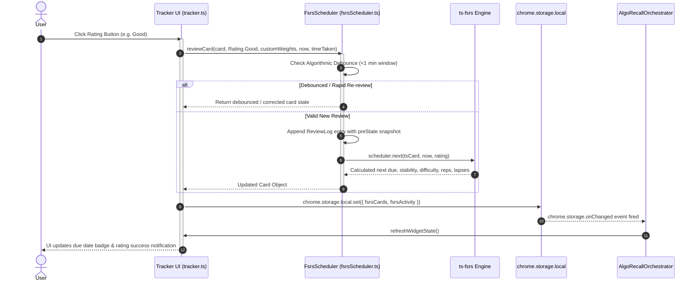
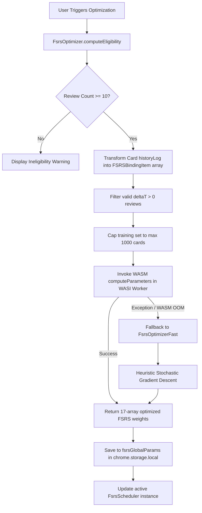
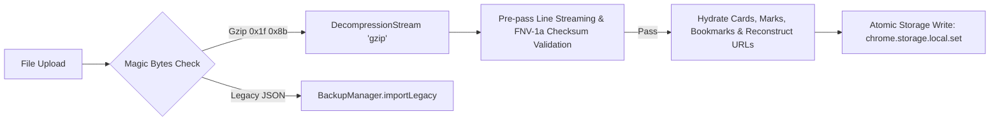

# End-to-End Data Pipelines

This document details the end-to-end data processing pipelines in **AlgoRecall**, tracing how data flows between Chrome Storage, Content Scripts, the FSRS Scheduler, the WASM Optimization Engine, and UI components.

---

## 🔄 Card Review & Spaced Repetition Data Flow

When a user reviews a problem on a whitelisted coding platform (e.g. LeetCode or AlgoMonster), the rating choice (`Again`, `Hard`, `Good`, `Easy`) is processed through `FsrsScheduler` and saved to local storage.

---

## 🧠 WASM Parameter Optimization Data Flow

When the user triggers parameter optimization, the system executes WASM-compiled Rust code (`@open-spaced-repetition/binding`) to compute personalized FSRS weights from review history.

---

## 💾 Backup & Restore Data Flow

The `BackupManager` provides streaming export and import pipelines using Gzip compression and JSON Lines (JSONL).

### Export Pipeline

### Import Pipeline

---

## 🔗 Related Documentation
* 📘 [Architecture Overview](file:///Users/anmolrastogi/Documents/GitHub/algomonster-fsrs-extension/docs/architecture/overview.md)
* 📦 [State Management](file:///Users/anmolrastogi/Documents/GitHub/algomonster-fsrs-extension/docs/architecture/state-management.md)
* 🧮 [FSRS Algorithm Theory](file:///Users/anmolrastogi/Documents/GitHub/algomonster-fsrs-extension/docs/scheduler-wasm/fsrs-algorithm.md)
* ⚡ [WASM Optimizer Runtime](file:///Users/anmolrastogi/Documents/GitHub/algomonster-fsrs-extension/docs/scheduler-wasm/optimizer-wasm.md)
* 🛠️ [Backup Manager Details](file:///Users/anmolrastogi/Documents/GitHub/algomonster-fsrs-extension/docs/features/common.md)
