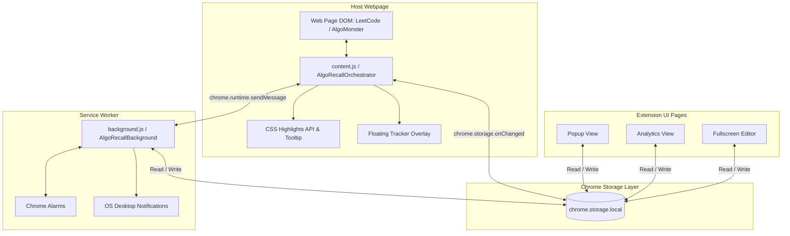
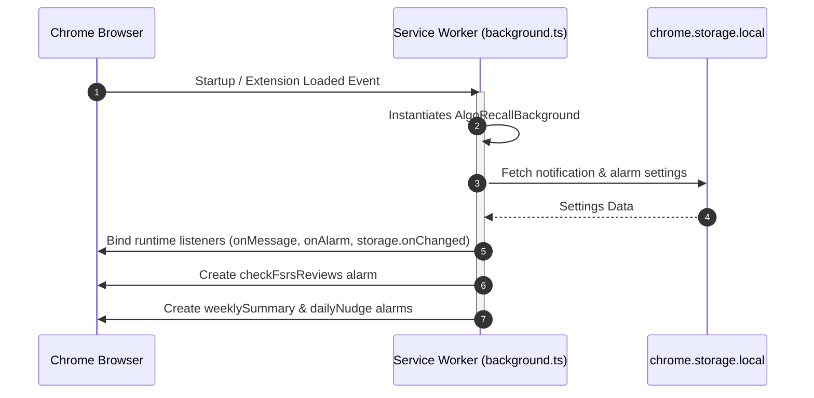

# Architecture Overview

This document provides a high-level technical overview of **AlgoRecall**, a Manifest V3 Chrome Extension built with TypeScript and Webpack. It covers the overall system architecture, runtime message passing interfaces, service worker lifecycle, and content script injection models.

---

## 🏛️ System Architecture

AlgoRecall follows a decoupled 3-tier Chrome Extension architecture:
1. **Background Layer**: Event-driven Manifest V3 Service Worker managing alarms, push notifications, and background timers.
2. **Content Layer**: Injected client-side script (`AlgoRecallOrchestrator`) handling DOM overlays, problem detection, and text highlighting on whitelisted platforms.
3. **UI Layer**: Isolated extension pages (Popup, Analytics, Fullscreen Editor, History, Pomodoro) rendering statistics and configuration UI.



---

## ⚙️ Manifest V3 & Service Worker Lifecycle

In Chrome Extension Manifest V3, background pages are replaced by **Service Workers** (`background/background.ts`). Service workers are ephemeral—they start when triggered by Chrome API events or alarms, execute asynchronous handlers, and automatically terminate when idle.

### Key Architectural Constraints
* **No DOM Access**: The background service worker cannot access `document` or `window`.
* **Non-Persistent Memory**: Global in-memory variables reset when the service worker sleeps. All state MUST be persisted in `chrome.storage.local`.
* **Alarm-Driven Execution**: Scheduled tasks (e.g. review checks, weekly summary digest, daily nudge, Pomodoro timer completion) rely on `chrome.alarms`.

### Service Worker Initialization Sequence



---

## 📡 Message Passing Architecture

Communication between Content Scripts, Extension Pages, and the Background Service Worker uses Chrome's Messaging API (`chrome.runtime.sendMessage` and `chrome.tabs.sendMessage`).

### `MessageType` Enum (`types/domain.ts`)

```typescript
export enum MessageType {
    SYNC_CARD = 'SYNC_CARD',
    GET_CARD = 'GET_CARD',
    DELETE_CARD = 'DELETE_CARD',
    POMODORO_ACTION = 'POMODORO_ACTION',
    TEST_NOTIFICATION = 'TEST_NOTIFICATION',
    TOGGLE_WEEKLY_SUMMARY = 'TOGGLE_WEEKLY_SUMMARY',
    SNOOZE_NOTIFICATION = 'SNOOZE_NOTIFICATION',
    SAVE_APPROACH = 'SAVE_APPROACH',
    REFRESH_STATE = 'REFRESH_STATE'
}
```

### Standard Extension Message Structure

```typescript
export interface ExtensionMessage {
    type?: MessageType | string;
    action?: MessageType | string;
    payload?: unknown;
    minutes?: number;
    enabled?: boolean;
    [key: string]: unknown;
}

export interface MessageResponse<T = unknown> {
    success: boolean;
    data?: T;
    error?: string;
    [key: string]: unknown;
}
```

### Async Message Handling Contract
Background message handlers (`handleMessage`) returning `true` instruct Chrome to keep the message channel open for an asynchronous call to `sendResponse`:

```typescript
if (message.action === 'test_notification') {
    (async () => {
        try {
            await this.showTestNotification();
            sendResponse({ success: true });
        } catch (err) {
            sendResponse({ success: false, error: String(err) });
        }
    })();
    return true; // Keep channel open for async sendResponse
}
```

---

## 🔗 Related Documentation
* 📊 [End-to-End Data Flow](file:///Users/anmolrastogi/Documents/GitHub/algomonster-fsrs-extension/docs/architecture/data-flow.md)
* 📦 [State Management](file:///Users/anmolrastogi/Documents/GitHub/algomonster-fsrs-extension/docs/architecture/state-management.md)
* 📖 [FSRS Rating Guide](file:///Users/anmolrastogi/Documents/GitHub/algomonster-fsrs-extension/docs/FSRS_RATING_GUIDE.md)
* 🛠️ [Customization Guide](file:///Users/anmolrastogi/Documents/GitHub/algomonster-fsrs-extension/docs/CUSTOMIZATION.md)
