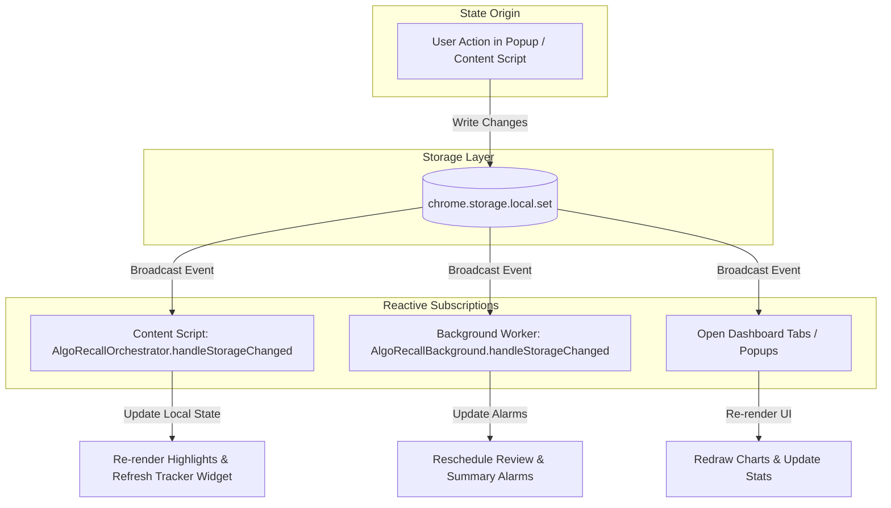

# State Management Architecture

This document describes how state is managed and distributed across extension contexts in **AlgoRecall**. It details the `StorageData` schema, local storage reactivity via `chrome.storage.onChanged`, transient UI state, and cross-tab synchronization.

---

## 🗄️ Storage Schema (`types/domain.ts`)

AlgoRecall uses `chrome.storage.local` as its single source of truth. All domain entities, parameters, user preferences, and activity logs are stored under specific keys within the `StorageData` interface.

```typescript
export interface StorageData {
    fsrsCards?: Card[];
    fsrsActivity?: { [date: string]: number };
    fsrsTopicWeights?: { [topic: string]: number[] };
    fsrsGlobalParams?: FSRSParameters | Partial<FSRSParameters>;
    notificationSettings?: NotificationSettings;
    whitelistedWebsites?: WhitelistedWebsite[];
    chromeSettings?: ChromeSettings;
    theme?: string;
    marks?: HighlightMark[];
    bookmarks?: BookmarkItem[];
    pomodoroState?: PomodoroState;
    pomodoroSettings?: PomodoroSettings;
    pomodoroStats?: PomodoroStats;
    userSettings?: UserSettings;
    [key: string]: unknown;
}
```

---

## 🔄 Reactive Storage Sync (`chrome.storage.onChanged`)

Because extension contexts (Content Scripts, Service Worker, Popup, Analytics) run in isolated JavaScript environments, state synchronization is achieved through `chrome.storage.onChanged` event listeners.



### Content Script Handler Example (`content/content.ts`)
```typescript
handleStorageChanged(changes: { [key: string]: chrome.storage.StorageChange }, areaName: string): void {
    if (areaName === 'local') {
        if (changes.fsrsCards) {
            this.state.cards = (changes.fsrsCards.newValue as Card[]) || [];
            this.tracker.refreshWidgetState();
        }
        if (changes.marks) {
            this.state.marks = (changes.marks.newValue as unknown[]) || [];
            this.highlighter.applyHighlightsForCurrentPage();
        }
        if (changes.theme) {
            this.state.currentTheme = changes.theme.newValue || 'dark';
            this.applyThemeClass();
        }
    }
}
```

---

## ⚡ Transient State vs. Persistent State

| State Category | Lifecycle | Storage Location | Example Entities |
| :--- | :--- | :--- | :--- |
| **Persistent Domain Data** | Permanent across sessions | `chrome.storage.local` | `fsrsCards`, `marks`, `bookmarks`, `fsrsActivity` |
| **Persistent User Config** | Permanent across sessions | `chrome.storage.local` | `notificationSettings`, `fsrsGlobalParams`, `theme` |
| **Transient Pomodoro State** | Active countdown session | `chrome.storage.local` + SW memory | `pomodoroState`, `targetEndTime` |
| **Transient Content State** | In-memory during page session | `window.AlgoRecall.state` | `activeMarkRanges`, `hoveredMarkId`, `debounceTimer` |

---

## 🔗 Related Documentation
* 📘 [Architecture Overview](file:///Users/anmolrastogi/Documents/GitHub/algomonster-fsrs-extension/docs/architecture/overview.md)
* 🔄 [End-to-End Data Flow](file:///Users/anmolrastogi/Documents/GitHub/algomonster-fsrs-extension/docs/architecture/data-flow.md)
* 📐 [Global Types & Utilities](file:///Users/anmolrastogi/Documents/GitHub/algomonster-fsrs-extension/docs/runtime-core/utils-and-types.md)
* 🛠️ [Customization Guide](file:///Users/anmolrastogi/Documents/GitHub/algomonster-fsrs-extension/docs/CUSTOMIZATION.md)
