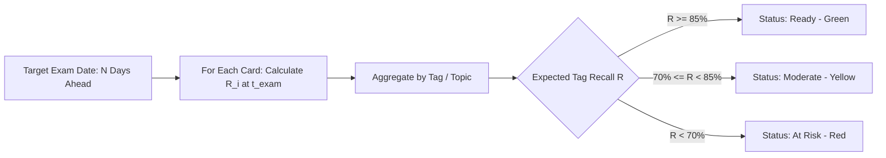

# Analytics Engine Deep Dive

This document details the analytical engine in **AlgoRecall**, explaining the statistical algorithms, memory health metrics, retention calculations, exam readiness model, learning velocity, and future memory simulations implemented in `features/dashboard/analytics/`.

---

## 🔬 Analytics Module Structure

```text
features/dashboard/analytics/
├── analytics.ts                       # Main Analytics UI controller & view tab switcher
├── utils/dataUtils.ts                 # Core DataUtils aggregation class
├── overview/
│   ├── overview.ts                    # High-level metrics dashboard
│   ├── memoryHealth.ts                # Memory Health score calculation
│   ├── learningVelocity.ts            # 7-day / 14-day velocity sparklines
│   └── miniForecast.ts                # 7-day mini workload forecast
├── memory/
│   ├── memory.ts                      # Retention & memory stability tab
│   ├── retentionChart.ts              # Historical vs true retention chart
│   ├── futureMemorySimulation.ts      # Memory decay simulation slider (0-180 days)
│   ├── confidenceBand.ts              # Confidence band estimation
│   └── predictionComparison.ts        # Model prediction accuracy
├── readiness/
│   └── readiness.ts                   # Exam Readiness score per topic/tag
├── tags/
│   ├── tags.ts                        # Tag coverage overview
│   ├── coverageTable.ts               # Tag retention & lapse breakdown table
│   └── retentionBarChart.ts           # Comparative tag retention bar chart
├── performance/
│   ├── performance.ts                 # Lapse & recovery leaderboard
│   ├── recoveryTracking.ts            # Recovered cards tracker (stabilities > threshold)
│   └── reviewStats.ts                 # Total reps & lapse distributions
└── insights/
    ├── insights.ts                    # Time-of-day review efficiency
    └── reviewTimeAnalytics.ts         # Morning/Afternoon/Evening/Night performance
```

---

## 🧮 Core Analytics Algorithms (`dataUtils.ts`)

### 1. Retention vs. True Retention
* **Observed Retention**:
  $$\text{Retention} = \frac{\text{Total Reps} - \text{Total Lapses}}{\text{Total Reps}} \times 100$$
* **True Retention (Retrievability Weighting)**: Calculates active retrievability $R(t)$ for each card at current timestamp $t$:
  $$\text{True Retention} = \frac{1}{N_{\text{reviewed}}} \sum_{i=1}^{N_{\text{reviewed}}} R_i(t) \times 100$$

### 2. Learning Velocity & Trends (`learningVelocity.ts`)
Tracks 7-day sliding window counts of new cards created, graduated cards (stability $> 21.0$ days), and total reviews:
$$\text{Trend \%} = \frac{\text{Count}_{\text{this\_week}} - \text{Count}_{\text{last\_week}}}{\text{Count}_{\text{last\_week}}} \times 100$$

### 3. Exam Readiness Model (`readiness.ts`)
Predicts overall expected recall rate across all cards if an exam occurs $N$ days ahead ($N \in [1, 90]$):
1. Evaluates target date $t_{\text{exam}} = t_{\text{now}} + N \times 86400000$.
2. For each card $i$, projects retrievability $R_i(t_{\text{exam}})$.
3. Groups cards by tag/topic and assigns risk classifications:
   * **Ready (Green)**: Projected $R \ge 85\%$
   * **Moderate (Yellow)**: Projected $70\% \le R < 85\%$
   * **At Risk (Red)**: Projected $R < 70\%$



---

## 📉 Future Memory Simulation (`futureMemorySimulation.ts`)

Predicts memory retention decay assuming the user stops reviewing altogether:
* Evaluates memory decay at $t \in [0, 15, 30, 45, 60, 90, 120, 150, 180]$ days.
* Computes forgotten card count ($R_i(t) < 0.70$).
* Renders interactive slider allowing custom date predictions.

---

## 🔗 Related Documentation
* 📘 [Architecture Overview](file:///Users/anmolrastogi/Documents/GitHub/algomonster-fsrs-extension/docs/architecture/overview.md)
* 🧮 [FSRS Algorithm Theory](file:///Users/anmolrastogi/Documents/GitHub/algomonster-fsrs-extension/docs/scheduler-wasm/fsrs-algorithm.md)
* 📊 [Dashboard Views](file:///Users/anmolrastogi/Documents/GitHub/algomonster-fsrs-extension/docs/features/dashboard.md)
