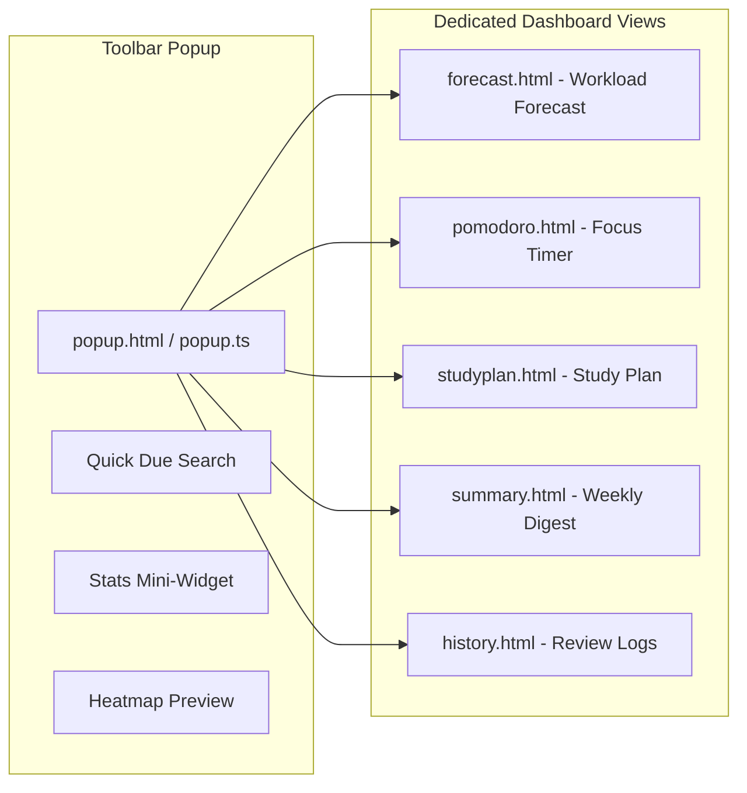

# Dashboard & Extension Views

This document provides a technical overview of the primary extension dashboard pages and popup interfaces in **AlgoRecall**.

---

## 🖼️ Dashboard Architecture

AlgoRecall provides dedicated HTML/TS popup and dashboard views:

```text
features/dashboard/
├── popup/           # Extension toolbar popup (search, stats, due list, quick rating)
├── forecast/        # 30-day review workload forecast chart
├── pomodoro/        # Persistent Pomodoro focus timer linked to background SW
├── studyplan/       # AI & algorithmic study plan generator based on due cards & tags
├── summary/         # Weekly digest generator view
├── history/         # Chronological review log audit view
└── heatmap/         # GitHub-style 365-day review activity heatmap
```



---

## ⏱️ Persistent Pomodoro Timer Sync (`pomodoro.ts`)

The Pomodoro module provides a focus timer synchronized between the frontend UI and the background service worker:
1. **Running Timer**: When started, target completion timestamp (`targetEndTime`) is written to `pomodoroState` in `chrome.storage.local`.
2. **Background Ticker**: `AlgoRecallBackground.startPomodoroTick()` updates the extension badge text (`15m`, `45s`) and icon title every second.
3. **Service Worker Alarm**: A `pomodoroEnd` Chrome alarm is scheduled so that if the background worker goes idle, Chrome wakes it up at exact timer expiration.
4. **Phase Transitions**: Focus (25 min) $\rightarrow$ Short Break (5 min) $\rightarrow$ Long Break (15 min after 4 sessions).

---

## 📊 Forecast & Review Workload (`forecast.ts`)

The Forecast module projects future review workload across a 30-day window:
* Iterates over `fsrsCards` in storage.
* Groups due timestamps (`card.due`) into calendar dates ($YYYY-MM-DD$).
* Calculates projected review counts per day to help users plan study sessions.

---

## 📜 Review History Audit (`history.ts`)

The History view provides an audit trail of all past review interactions:
* Extracts `historyLog` entries across all stored cards.
* Displays rating choice (`Again`, `Hard`, `Good`, `Easy`), review date, duration, and stability progression.
* Filters history by problem title, tag, or rating.

---

## 🔗 Related Documentation
* 📈 [Analytics Engine](file:///Users/anmolrastogi/Documents/GitHub/algomonster-fsrs-extension/docs/features/analytics.md)
* ⚙️ [Background Service Worker](file:///Users/anmolrastogi/Documents/GitHub/algomonster-fsrs-extension/docs/runtime-core/background-service.md)
* 🎯 [Tracker & Editor](file:///Users/anmolrastogi/Documents/GitHub/algomonster-fsrs-extension/docs/features/tracker.md)
