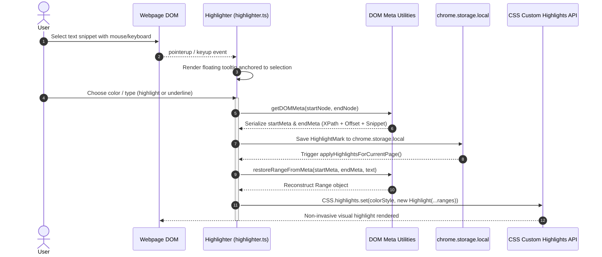

# Highlighter & Annotation Manager

This document provides a technical explanation of the in-page text selection highlighter, floating tooltip UI, CSS Custom Highlights API integration, DOM metadata range restoration, and options configuration in **AlgoRecall**.

---

## 🖍️ Architecture & Custom CSS Highlights API

AlgoRecall uses the modern **CSS Custom Highlights API** (`CSS.highlights` and `Highlight`) rather than mutating host page DOM nodes with wrapper `<span>` elements. This prevents breaking React/Vue virtual DOM nodes on platforms like LeetCode or AlgoMonster.



---

## 📍 Range Serialization (`DOMMeta`)

To persist text highlights across page reloads without storing volatile DOM node references, `HighlightMark` objects store `DOMMeta` metadata:

```typescript
export interface DOMMeta {
    path?: string;        // Element XPath / DOM hierarchy path
    offset?: number;      // Text node character offset
    textSnippet?: string; // Text content preview for fuzzy validation
}

export interface HighlightMark {
    id: string;
    url: string;
    text: string;
    color: string;
    type?: string;        // 'highlight' or 'underline'
    createdAt: number;
    note?: string;
    category?: string;    // 'Key Insight', 'Gotcha', 'Edge Case', 'Pattern'
    highlightSource?: {
        startMeta?: DOMMeta;
        endMeta?: DOMMeta;
    };
}
```

---

## 🔗 Linking Highlights to FSRS Cards

Highlighters can be directly linked to active FSRS cards (`linkHighlightToCard`):
* Extracts selected text, category prefix, and optional notes.
* Formats note as a markdown blockquote (`> **Key Insight:** ...`).
* Appends content directly to card's `approach` markdown field or active problem draft (`approachDrafts`).

---

## ⚙️ Options & Palette Configurations (`highlightOptions.ts`)

Users can manage highlighter configurations via `highlightOptions.html`:
* **Color Palettes**: Default, Warm Pastels, Ocean Breeze, Forest Moss, Sunset Glow.
* **Custom Swatches**: Custom hex color picker.
* **Toggle Marker Popup**: Enable or disable the floating tooltip on text selection.

---

## 🔗 Related Documentation
* 🖥️ [Content Scripts Core](file:///Users/anmolrastogi/Documents/GitHub/algomonster-fsrs-extension/docs/runtime-core/content-scripts.md)
* 🎯 [Tracker & Editor](file:///Users/anmolrastogi/Documents/GitHub/algomonster-fsrs-extension/docs/features/tracker.md)
* 🛠️ [Customization Guide](file:///Users/anmolrastogi/Documents/GitHub/algomonster-fsrs-extension/docs/CUSTOMIZATION.md)
