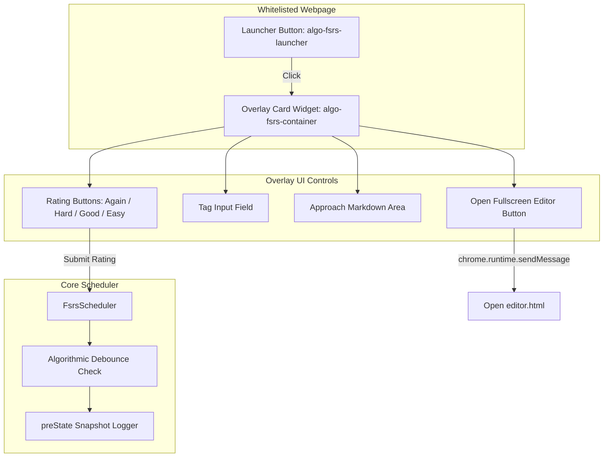

# Tracker & Editor Feature Module

This document provides a detailed breakdown of the **Tracker** overlay UI, full-screen **Editor**, rating interaction mechanics, preState snapshots, and algorithmic debouncing logic.

---

## 🧩 Module Overview

The Tracker module consists of:
* **Floating Tracker Launcher & Overlay (`features/tracker/tracker.ts`)**: Injected into whitelisted coding problem pages to present due status, tags, and rating buttons (`Again`, `Hard`, `Good`, `Easy`).
* **Full-Screen Editor (`features/tracker/editor/editor.ts`)**: Standalone page (`editor.html`) allowing rich editing of card fields (problem title, URL, tags, approach markdown, complexity).
* **FSRS Configuration Modal (`features/tracker/config/fsrsConfig.ts`)**: Parameter tuning modal (`fsrsConfig.html`) for editing global $w$ weights, target retention, and triggering optimization.
* **Abstract Scheduler Base (`features/tracker/scheduler/scheduler.ts`)**: Base interface extended by `FsrsScheduler`.



---

## ⚡ Algorithmic Debouncing & Rating Corrections

To prevent accidental double-clicks or key mashing from corrupting FSRS stability metrics, `FsrsScheduler` implements rapid re-review debouncing (< 1 minute window).

### Scenario 1: Duplicate Rating Submission (< 1 minute)
If a user clicks the same rating button twice in under 1 minute:
* FSRS calculation is **suppressed**.
* Additional review duration is added to the existing log entry.
* The review count and history log length remain unchanged.

### Scenario 2: Rating Correction (< 1 minute)
If a user mis-clicks `Good` and immediately changes their selection to `Again`:
1. The last review log entry is popped from `historyLog`.
2. Card fields (`stability`, `difficulty`, `reps`, `lapses`, `due`, `state`) are restored from the `preState` snapshot.
3. `reviewCard()` is re-executed from the restored base state using the new rating.

```typescript
// preState snapshot structure stored in ReviewLog
export interface ReviewLog {
    rating: Rating | number;
    date: number;
    duration?: number;
    preState?: {
        stability: number;
        difficulty: number;
        reps: number;
        lapses: number;
        state: State;
        due: number;
        last_review?: number | null;
        elapsed_days?: number;
        scheduled_days?: number;
        learning_steps?: number;
    };
}
```

---

## 📝 Full-Screen Editor (`editor.ts`)

The Editor UI handles standalone card creation and modification. Key features include:
* Auto-populating problem title and URL from active tab parameters.
* Real-time markdown preview for problem approaches.
* Time and space complexity fields ($O(N)$, $O(1)$).
* Interactive tag management with auto-suggestions.

---

## 🔗 Related Documentation
* 🧮 [FSRS Algorithm Theory](file:///Users/anmolrastogi/Documents/GitHub/algomonster-fsrs-extension/docs/scheduler-wasm/fsrs-algorithm.md)
* 📖 [FSRS Rating Selection Guide](file:///Users/anmolrastogi/Documents/GitHub/algomonster-fsrs-extension/docs/scheduler-wasm/rating-guide.md)
* ⚙️ [Developer & Customization Guide](file:///Users/anmolrastogi/Documents/GitHub/algomonster-fsrs-extension/docs/features/customization.md)
* 📋 [Feature Enhancements Requirements](file:///Users/anmolrastogi/Documents/GitHub/algomonster-fsrs-extension/docs/features/requirements.md)
* 🖥️ [Content Scripts Core](file:///Users/anmolrastogi/Documents/GitHub/algomonster-fsrs-extension/docs/runtime-core/content-scripts.md)
