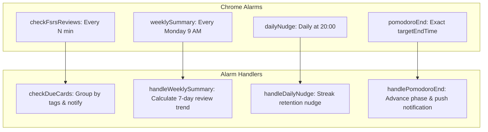

# Background Service Worker Architecture

This document details the background service worker implementation (`background/background.ts`), class structure (`AlgoRecallBackground`), Chrome alarms, notification handlers, and Pomodoro timer synchronization.

---

## ⚙️ Service Worker Lifecycle & Event Binding

The background service worker is instantiated as an object-oriented class:

```typescript
export class AlgoRecallBackground {
    private pomodoroIntervalId: ReturnType<typeof setInterval> | null = null;
    
    constructor() {
        this.init();
    }
    
    async init(): Promise<void> {
        this.bindEvents();
        await this.resumePomodoroBackground();
    }
    
    bindEvents(): void {
        chrome.runtime.onInstalled.addListener(this.handleInstalled.bind(this));
        chrome.alarms.onAlarm.addListener(this.handleAlarm.bind(this));
        chrome.webNavigation.onHistoryStateUpdated.addListener(this.handleHistoryStateUpdated.bind(this));
        chrome.storage.onChanged.addListener(this.handleStorageChanged.bind(this));
        chrome.runtime.onMessage.addListener(this.handleMessage.bind(this));
        chrome.notifications.onClicked.addListener(this.handleNotificationClicked.bind(this));
    }
}
```

---

## ⏰ Chrome Alarms Registry

The background service worker registers four distinct alarms to drive periodic background tasks:



---

## 🌙 Quiet Hours Filter

Before firing desktop review notifications (`checkDueCards`), `AlgoRecallBackground` evaluates user-configured quiet hours (e.g. 23:00 to 07:00), automatically suppressing alerts during sleep windows.

---

## 🔗 Related Documentation
* 📘 [Architecture Overview](file:///Users/anmolrastogi/Documents/GitHub/algomonster-fsrs-extension/docs/architecture/overview.md)
* 📊 [Dashboard Views](file:///Users/anmolrastogi/Documents/GitHub/algomonster-fsrs-extension/docs/features/dashboard.md)
* 📐 [Global Types & Utilities](file:///Users/anmolrastogi/Documents/GitHub/algomonster-fsrs-extension/docs/runtime-core/utils-and-types.md)
