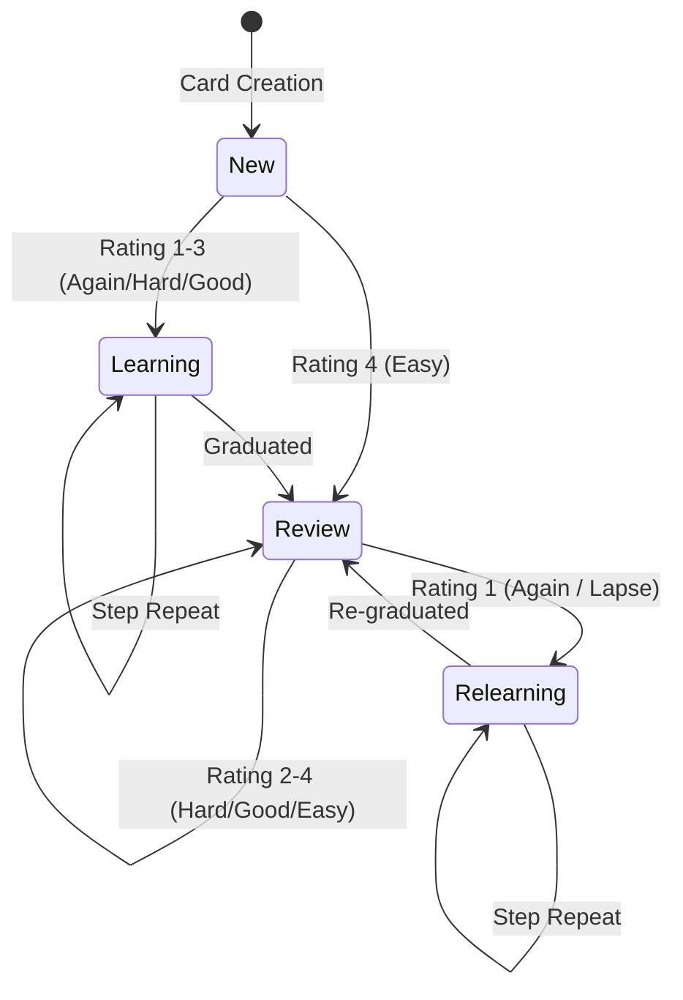

# FSRS Scheduler Theory & Mathematics

This document details the mathematical theory, formulas, parameters, and state transition mechanics of the **Free Spaced Repetition Scheduler (FSRS-4.5)** algorithm implemented in `features/tracker/scheduler/fsrsScheduler.ts`.

---

## 🧮 Theoretical Foundation & Parameters

FSRS models memory stability ($S$) and difficulty ($D$) as continuous variables, predicting memory retrievability ($R$) over elapsed time ($t$).

### Default FSRS-4.5 Parameter Vector ($w \in \mathbb{R}^{17}$)
```typescript
export const DEFAULT_FSRS_W = [
    0.40255, 1.18385, 3.173,   15.69105, 7.1949,  0.5345,  1.4604,  0.0046,
    1.54575, 0.1192,  1.01925, 1.9395,   0.11,    0.29605, 2.2698,  0.2315, 2.9898
];
export const DEFAULT_FSRS_DECAY = -0.5;
export const DEFAULT_FSRS_FACTOR = 19 / 81; // ~0.2345679
export const DEFAULT_FSRS_REQUEST_RETENTION = 0.90; // Target 90% retention rate
```

---

## 📐 Core Formulas

### 1. Retrievability (Forgetting Curve)
Retrievability $R(t, S)$ represents the probability of successful recall after $t$ elapsed days given stability $S$:

$$R(t, S) = \left(1 + \text{factor} \cdot \frac{t}{S}\right)^{\text{decay}} = \left(1 + \frac{19}{81} \cdot \frac{t}{S}\right)^{-0.5}$$

### 2. Next Scheduled Interval ($I$)
Given requested target retention $R_{\text{target}}$ (default 0.90):

$$I(S, R_{\text{target}}) = \frac{S}{\text{factor}} \cdot \left(R_{\text{target}}^{\frac{1}{\text{decay}}} - 1\right)$$

### 3. Initial Stability ($S_0$) for New Cards
When a new card is rated $r \in \{1, 2, 3, 4\}$ (`Again`, `Hard`, `Good`, `Easy`):

$$S_0(r) = w_{r-1}$$

### 4. Initial Difficulty ($D_0$) for New Cards
$$D_0(r) = w_4 - \exp(w_5 \cdot (r - 1)) + 1$$

---

## 🔄 Card State Transitions

FSRS cards transition across four fundamental states: `New (0)`, `Learning (1)`, `Review (2)`, and `Relearning (3)`.



For comprehensive rating selection guidance (`Again`, `Hard`, `Good`, `Easy`), consult the [FSRS Rating Guide](file:///Users/anmolrastogi/Documents/GitHub/algomonster-fsrs-extension/docs/FSRS_RATING_GUIDE.md).

---

## 🔗 Related Documentation
* ⚡ [WASM Optimizer Runtime](file:///Users/anmolrastogi/Documents/GitHub/algomonster-fsrs-extension/docs/scheduler-wasm/optimizer-wasm.md)
* 🚀 [Scheduler Performance](file:///Users/anmolrastogi/Documents/GitHub/algomonster-fsrs-extension/docs/scheduler-wasm/performance.md)
* 🎯 [Tracker Feature](file:///Users/anmolrastogi/Documents/GitHub/algomonster-fsrs-extension/docs/features/tracker.md)
* 📖 [FSRS Rating Guide](file:///Users/anmolrastogi/Documents/GitHub/algomonster-fsrs-extension/docs/FSRS_RATING_GUIDE.md)
