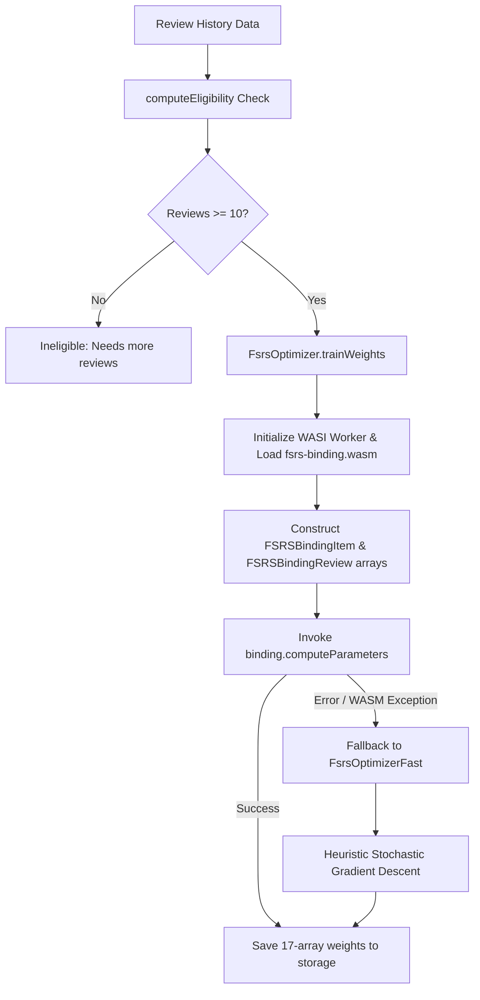

# WASM Parameter Optimizer Runtime

This document details the WASM optimization architecture in **AlgoRecall**, contrasting the exact WebAssembly Rust optimizer (`fsrsOptimizer.ts`) with the lightweight JavaScript fallback optimizer (`fsrsOptimizerFast.ts`).

---

## ⚙️ Optimization Architecture Overview

To personalize the 17 $w$ weight parameters to an individual user's learning speed, AlgoRecall trains on historical review logs (`card.historyLog`).



---

## 🧮 Training Dataset Construction

For FSRS parameter training:
1. Reviews are converted into `FSRSBindingReview(rating, deltaT)` instances.
2. The initial review on a card MUST have $\Delta t = 0$.
3. Subsequent reviews compute $\Delta t = \text{round}\left(\frac{t_{\text{current}} - t_{\text{previous}}}{86400000}\right)$ in days.
4. Only cards with at least one follow-up review ($\Delta t > 0$) are included in `trainSet`.
5. The dataset size is capped at `OPTIMIZER_MAX_TRAINING_CARDS = 1000` to prevent WASM Out-Of-Memory (OOM) or timeouts.

```typescript
export interface WasmBinding {
    FSRSBindingReview: new (rating: number, deltaT: number) => FSRSBindingReview;
    FSRSBindingItem: new (reviews: FSRSBindingReview[]) => FSRSBindingItem;
    computeParameters: typeof computeParameters;
}
```

---

## ⚡ Fallback Fast Optimizer (`fsrsOptimizerFast.ts`)

In certain Chrome MV3 environments (or restricted Content Security Policy contexts where WASM evaluation is blocked), `FsrsOptimizer` throws an exception. `FsrsOptimizerFast` provides a lightweight JavaScript fallback:
* Evaluates empirical retention:
  $$\text{Retention}_{\text{empirical}} = \frac{\text{Total Reps} - \text{Total Lapses}}{\text{Total Reps}}$$
* Performs simulated Stochastic Gradient Descent (SGD) tuning initial stabilities $w_0 - w_3$ and baseline difficulty $w_4$ over 50 epochs.
* Yields to the main thread via `await new Promise(r => setTimeout(r, 0))` on each epoch to prevent UI freezing.

---

## 🔗 Related Documentation
* 🧮 [FSRS Algorithm & Math](file:///Users/anmolrastogi/Documents/GitHub/algomonster-fsrs-extension/docs/scheduler-wasm/fsrs-algorithm.md)
* 🚀 [Scheduler Performance](file:///Users/anmolrastogi/Documents/GitHub/algomonster-fsrs-extension/docs/scheduler-wasm/performance.md)
* 📐 [Global Types & Utilities](file:///Users/anmolrastogi/Documents/GitHub/algomonster-fsrs-extension/docs/runtime-core/utils-and-types.md)
