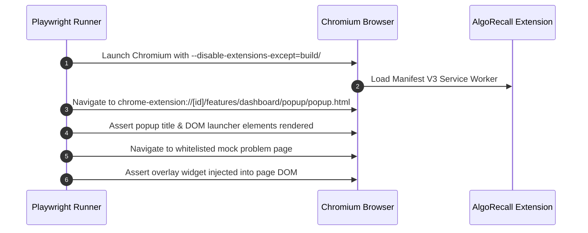

# Integration & Playwright E2E Testing

This document describes the integration test suites (`tests/integration/`) and Playwright end-to-end browser testing (`tests/e2e/`) in **AlgoRecall**. It outlines how these tests traverse multiple systems and how to interpret their results.

---

## 🔗 Integration Testing Suite (`tests/integration/`)

Integration tests evaluate multi-component interactions across storage, scheduler, and tracker UI. While they still run under Jest using Node.js/jsdom and mock the Chrome APIs, they instantiate multiple real classes simultaneously.

### Key Integration Scenarios
1. **`tracker.test.js`**:
   * Evaluates the complete lifecycle of creating a card on a problem page, reviewing it with rating `Good`, updating `fsrsCards` in storage, and verifying launcher badge updates.
2. **`multiCard.test.js`**:
   * Tests concurrent reviews across multiple cards with different tags.
   * Asserts tag-level aggregation correctness in `DataUtils.getStatsByTag()`.
3. **`test_opt.js`**:
   * Integration test for WASM parameter optimizer execution and storage write-back.

---

## 🎭 Playwright E2E Browser Testing (`tests/e2e/`)

Playwright tests run against the production Webpack build in a **real Chromium browser instance** with the compiled extension loaded via CLI flags.

### The Execution Workflow

### Authoring E2E Tests

When adding new specifications in `tests/e2e/`:
1. **Always Build First**: Ensure you run `npm run test:e2e` (which runs `npm run build` under the hood). Playwright tests the `/build` folder directly. Modifying source files will NOT reflect in E2E tests until a build occurs.
2. **Context Isolation**: Each test file spins up a new isolated browser context with a fresh installation of the extension. State (like indexedDB or `chrome.storage`) is not shared between test files.
3. **Mock Pages**: Do not navigate to real live external websites if possible. Use local HTML fixtures or strictly whitelisted static domains to ensure test stability and prevent network flakiness.

---

## 🐛 Debugging Failing Tests

If a Playwright test fails in CI or locally, it generates trace artifacts in the `/test-results/` directory (e.g. `/test-results/tracker-overlay-Tracker-Ov-c3cb0-g-buttons-for-existing-card/trace.zip`).

1. Open the Playwright Trace Viewer: `npx playwright show-trace path/to/trace.zip`
2. This UI allows you to scrub through a timeline, viewing the DOM state, console logs, and network requests exactly as they occurred during the failure.

---

## 🔗 Related Documentation
* 🧪 [Test Suite Overview](./test-suite-overview.md)
* 🔬 [Unit Test Coverage](./unit-tests.md)
* 🎯 [Tracker Feature](../features/tracker.md)
* 🤖 [Migration Rules & Guidelines](../../Agents.md)
