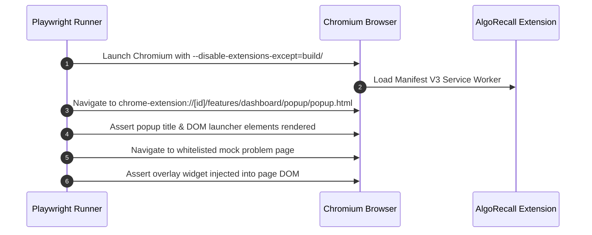

# Integration & Playwright E2E Testing

This document describes the integration test suites (`tests/integration/`) and Playwright end-to-end browser testing (`tests/e2e/`) in **AlgoRecall**.

---

## 🔗 Integration Testing Suite (`tests/integration/`)

Integration tests evaluate multi-component interactions across storage, scheduler, and tracker UI:

### Key Integration Scenarios
1. **`tracker.test.js`**:
   * Evaluates the complete lifecycle of creating a card on a problem page, reviewing it with rating `Good`, updating `fsrsCards` in storage, and verifying launcher badge updates.
2. **`multiCard.test.js`**:
   * Tests concurrent reviews across multiple cards with different tags.
   * Asserts tag-level aggregation correctness in `DataUtils.getStatsByTag()`.
3. **`test_opt.js`**:
   * Integration test for WASM parameter optimizer execution and storage write-back.

---

## 🎭 Playwright E2E Browser Testing (`tests/e2e/`)

Playwright tests run against the production Webpack build in a real Chromium browser instance with the extension unpacked.

### Configuration (`playwright.config.js`)
* **Test Directory**: `./tests/e2e`
* **Single Worker Execution**: Extension testing requires `workers: 1` to prevent storage context interference across parallel browser instances.
* **Trace Strategy**: `on-first-retry` trace recording.

### E2E Test Flow (`extension-load.spec.js`)

---

## 🔗 Related Documentation
* 🧪 [Test Suite Overview](file:///Users/anmolrastogi/Documents/GitHub/algomonster-fsrs-extension/docs/testing/test-suite-overview.md)
* 🔬 [Unit Test Coverage](file:///Users/anmolrastogi/Documents/GitHub/algomonster-fsrs-extension/docs/testing/unit-tests.md)
* 🎯 [Tracker Feature](file:///Users/anmolrastogi/Documents/GitHub/algomonster-fsrs-extension/docs/features/tracker.md)
* 🤖 [Migration Rules & Guidelines](file:///Users/anmolrastogi/Documents/GitHub/algomonster-fsrs-extension/Agents.md)
