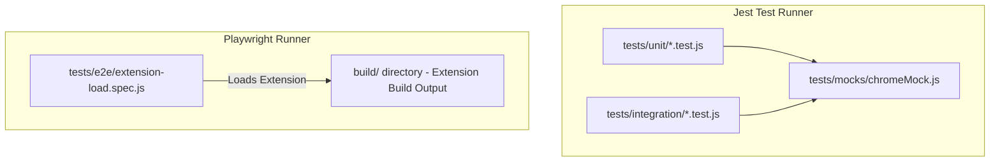

# Test Suite Architecture & Mocks Overview

This document provides a technical breakdown of the testing infrastructure in **AlgoRecall**, covering Jest unit/integration test setup, Playwright E2E configuration, mock environments (`chromeMock.js`), and test execution commands.

---

## 🧪 Testing Tier Overview

AlgoRecall enforces a 3-tier testing strategy:

```text
tests/
├── mocks/
│   ├── chromeMock.js      # Mock implementation for Chrome Extension APIs & Storage
│   └── styleMock.js       # CSS module import stub for Jest
├── unit/                  # Fast Jest unit tests for pure logic & algorithms
├── integration/           # Multi-component workflow integration tests
├── e2e/                   # Playwright E2E browser extension load tests
└── fixtures/              # Mock card fixtures & test datasets
```



---

## ⚙️ Jest Configuration (`jest.config.js`)

* **Preset**: `ts-jest` for TypeScript compilation during test runs.
* **Environment**: `jsdom` for browser DOM API simulation.
* **Setup Files**: Automatically loads `tests/mocks/chromeMock.js` before executing test suites.
* **Path Aliases**: Maps `@common`, `@tracker`, `@dashboard` to source folders.
* **HTML Reporter**: Generates interactive `test-report.html` execution reports.

---

## 🛠️ Chrome API Mock Environment (`chromeMock.js`)

`chromeMock.js` stubs Chrome APIs to enable running extension code in Node.js/Jest:
* `chrome.storage.local`: Implements in-memory `global.mockStorage` dictionary supporting `get`, `set`, `remove`, `clear` callbacks and Promises.
* `chrome.runtime`: Mocks `sendMessage`, `onMessage.addListener`, `getURL`.
* `chrome.tabs`: Mocks `query`, `sendMessage`, `create`.
* `chrome.alarms`: Mocks `create`, `clear`, `onAlarm.addListener`.
* `ReadableStream` & `TextEncoder`: Polyfills stream methods for `BackupManager` unit tests.

---

## 🏃 Test Execution Commands

```bash
# Run unit & integration test suites
npm test

# Run Playwright E2E browser tests
npx playwright test

# Build extension and execute full verification gate
npm run build && npm test
```

---

## 🔗 Related Documentation
* 🔬 [Unit Test Coverage](file:///Users/anmolrastogi/Documents/GitHub/algomonster-fsrs-extension/docs/testing/unit-tests.md)
* 🎭 [E2E & Integration Specs](file:///Users/anmolrastogi/Documents/GitHub/algomonster-fsrs-extension/docs/testing/e2e-integration.md)
* 🤖 [Migration Rules & Guidelines](file:///Users/anmolrastogi/Documents/GitHub/algomonster-fsrs-extension/Agents.md)
