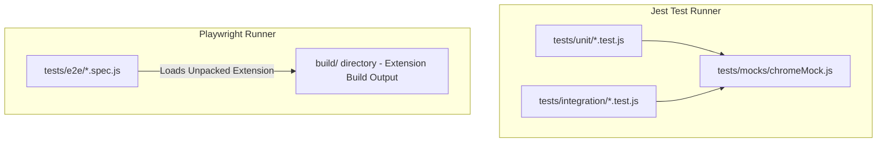

# Test Suite Architecture & Configuration Overview

This document provides a comprehensive technical breakdown of the testing infrastructure in **AlgoRecall**. It covers the 3-tier testing strategy, Jest configuration, Playwright E2E settings, artifact interpretation, and execution commands.

---

## 🧪 Testing Tier & Directory Architecture

AlgoRecall enforces a strict 3-tier testing strategy. All testing code and fixtures reside under the `/tests` directory:

```text
tests/
├── mocks/
│   ├── chromeMock.js      # Mock implementation for Chrome Extension APIs & Storage
│   └── importMetaPlugin.js # Babel plugin for import.meta compatibility in Jest
│   └── styleMock.js       # CSS module import stub for Jest
├── unit/                  # Fast Jest unit tests for pure logic, algorithms, and utilities
├── integration/           # Multi-component workflow integration tests
├── e2e/                   # Playwright E2E browser extension load tests
├── fixtures/              # Mock card fixtures & test datasets
└── test_opt.js            # WASM parameter optimizer execution tests
```

### Execution Flow


---

## 📦 Package Scripts (`package.json`)

The following npm scripts govern testing workflows:

| Script | Command | Purpose |
| :--- | :--- | :--- |
| `npm test` | `jest` | Executes standard Jest unit and integration tests based on `jest.config.js`. |
| `npm run test:coverage` | `jest --coverage` | Runs Jest and generates full LCOV/JSON coverage reports inside the `/coverage` directory. |
| `npm run test:e2e` | `npm run build && playwright test` | **Crucial:** Always builds the production Webpack bundle into `/build` first, then runs Playwright against that unpacked extension. |

---

## ⚙️ Jest Configuration Deep-Dive (`jest.config.js`)

Jest is configured to bridge Node.js and Browser Extension environments:

* **Environment**: `jsdom` is used to simulate browser DOM APIs natively required by frontend components.
* **Pre-processors (Transforms)**: 
  * `ts-jest` transpiles TypeScript files dynamically.
  * `babel-jest` processes JS files (and handles `import.meta` syntax via a custom plugin).
* **Setup Files**: Loads `tests/mocks/chromeMock.js` globally via `setupFilesAfterEnv`, meaning `chrome.*` APIs are stubbed automatically for every test.
* **Path Aliases (`moduleNameMapper`)**: Maps webpack-style aliases (`@common/`, `@tracker/`, `@dashboard/`) to their respective `features/` source folders.
* **Coverage Thresholds**: 
  * **Global**: Enforces a baseline of `65%` coverage (Statements, Branches, Functions, Lines).
  * **Algorithmic Files**: Strict overrides enforce **90-95% coverage** on critical core logic (e.g., `fsrsScheduler.ts`, `fsrsOptimizerFast.ts`, and memory analytics).

---

## 🎭 Playwright Configuration Deep-Dive (`playwright.config.js`)

Playwright handles real-browser end-to-end testing against the compiled extension:

* **Test Directory**: Targets `./tests/e2e`.
* **Worker Limits (`workers: 1`)**: Extensions cannot easily run in parallel within Playwright due to shared browser contexts and persistent storage conflicts. Parallelization (`fullyParallel`) is disabled.
* **Artifact Collection (`use.trace`)**: Set to `on-first-retry`. If a test fails and retries, Playwright records a full DOM snapshot trace.
* **Retries**: Configured to `2` retries in CI (`process.env.CI`), otherwise `0` locally.
* **Timeouts**: Generous `30000ms` global timeout to accommodate extension startup latency.

---

## 📊 Interpreting Test Artifacts

### 1. Jest Coverage Reports (`/coverage`)
When running `npm run test:coverage`, Jest outputs artifacts here:
* Open `coverage/lcov-report/index.html` in a browser for an interactive line-by-line coverage visualization.
* Uncovered critical paths (marked in red) should be addressed, particularly if they fall under the 90% threshold for algorithmic files.

### 2. Playwright Traces & Results (`/test-results`)
When Playwright tests fail (and retry), they dump trace artifacts here:
* Each folder (e.g., `tracker-overlay...`) corresponds to a specific test suite execution.
* **Viewing Traces**: You can inspect the step-by-step DOM snapshots and console logs by uploading the trace file to [trace.playwright.dev](https://trace.playwright.dev/) or running `npx playwright show-trace path/to/trace.zip`.

---

## 🔗 Related Documentation
* 🔬 [Unit Test Coverage & Mocks](./unit-tests.md)
* 🎭 [E2E & Integration Specs](./e2e-integration.md)
* 🤖 [Migration Rules & Guidelines](../../Agents.md)
